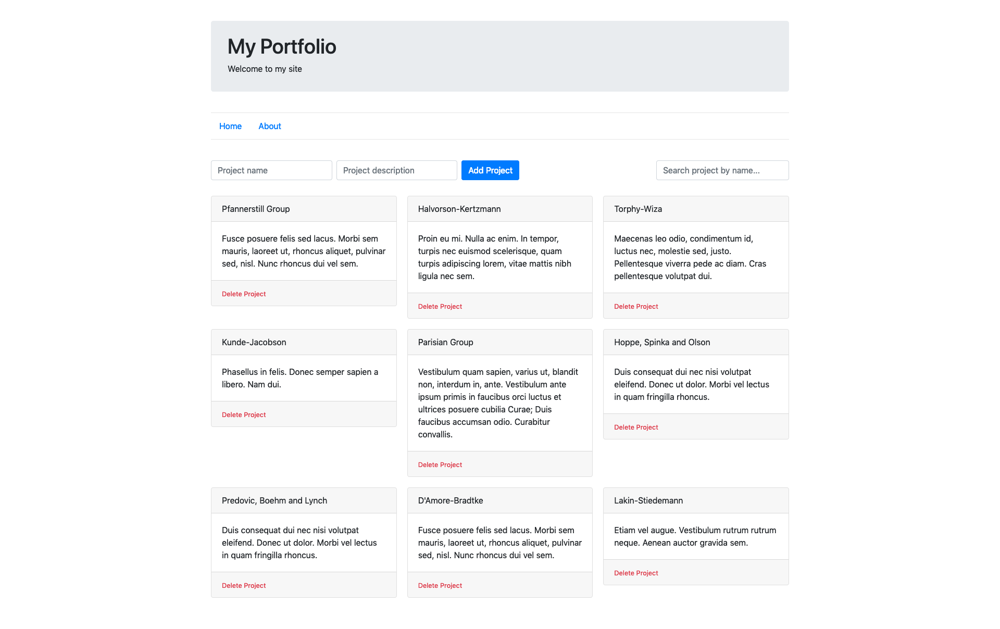
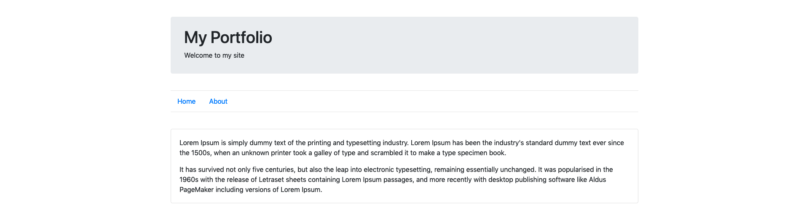

# My Portfolio

Task that tests candidate's skills for the opened front-end position

_Approximate time to complete the task: 4 hours (if you know what you're doing)_

#### Assignment description

Develop a small portfolio (SPA) that presents your projects and contains information about you.

The structure that should be used: 

**Home page**

- Header that contains Title and Slogan
- Navigation to navigate over the pages
- Projects component which should include the possibility of adding a project, a search engine (search by project name), and a list of projects. In addition, any project on the list should be able to be deleted

_Example:_

 

**About page**

- Information about you

_Example:_

 

KEEP IT SIMPLE! Focus on a minimal usable interface. Functionality takes priority over design.

#### Requirements

- Use [Typescript](https://www.typescriptlang.org/) for main application language
- Use [VueJS 2.x](https://vuejs.org/) for frontend framework
- Use [Vue Router](https://github.com/vuejs/vue-router) to manage routing
- Use [Axios](https://github.com/axios/axios) to consume API. The public folder contains a JSON file (**projects.json**) that you can use for requests.
- Use [Bootstrap-Vue](https://bootstrap-vue.js.org/) to create the UI
- Use [JSDoc](http://usejsdoc.org/) for the comments in the code

#### Would be a big plus if

- You use [Vuex](https://vuex.vuejs.org/) for state management

# Setup project

Before you start working, you need to install the following on your computer:

- [NodeJS](https://nodejs.org/en/)

#### Install the dependencies
```
npm install
```

#### Compiles and hot-reloads for development
```
npm run serve
```

#### Compiles and minifies for production
```
npm run build
```

#### Customize configuration
See [Configuration Reference](https://cli.vuejs.org/config/).
